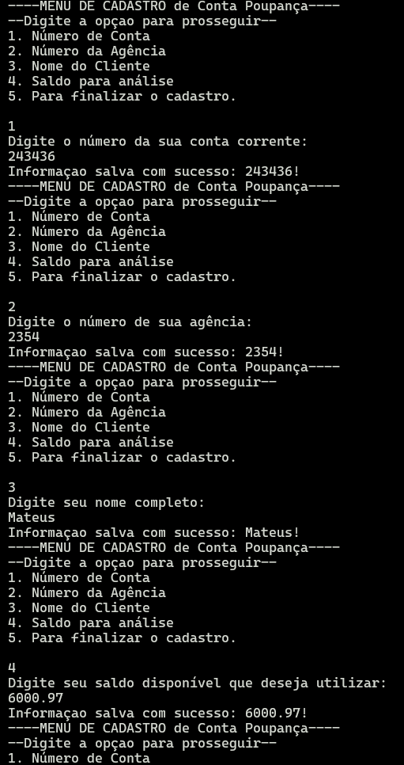
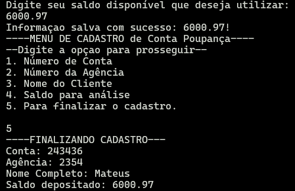

## VS CODE INSTRUCTIONS

Welcome to the VS Code Java world. Here is a guideline to help you get started to write Java code in Visual Studio Code.

## Folder Structure

The workspace contains two folders by default, where:

- `src`: the folder to maintain sources
- `lib`: the folder to maintain dependencies

Meanwhile, the compiled output files will be generated in the `bin` folder by default.

> If you want to customize the folder structure, open `.vscode/settings.json` and update the related settings there.

## Initiating Project

Run `main` in ContaPoupanca

Or in CLI, in the src run

> $ javac ContaPoupanca

> $ java ContaPoupanca

